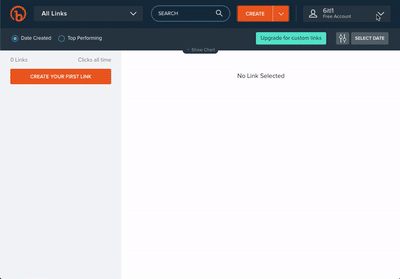
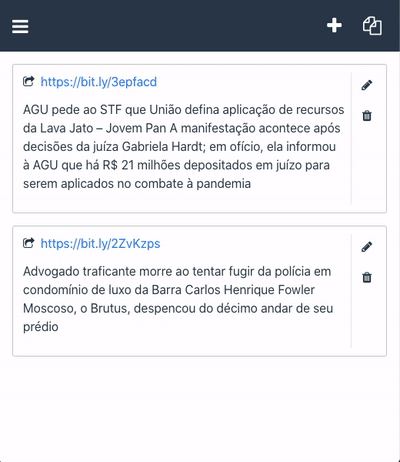

# Clipping
Este projeto utiliza as principais tecnologias:

[  ](https://vuejs.org/) [  ](https://www.electronjs.org/)  [ ](https://bitly.com/)

### Crie um token no [bitly](https://bitly.com/) para utilizar a api e gerar o short link


### Cole o Token em **menu/preferências** e altere os outros valores se desejar


### Copie o clipping para área de transferêcia e cole no sei WhastApp


## Project setup
```
npm install
```

### Compiles and hot-reloads for development
```
npm run serve
```

### Compiles and minifies for production
```
npm run build
```


